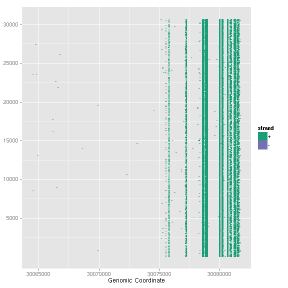

### Introduction

`autoplot` for *BamFile*. Default is using esimated coverage(fast) and the first
chromosome presented in the bam file header unless you specify a specific region
you want to visualize.

_For aesthetics mapping now, users have to pass them to aes() functions and
pass it into autoplot_, for example
    
	autoplot(data, color = score)
	
won't work, you have to use 

    autoplot(data, aes(color = score))
	
for now.	

### Objects
  * *BamFile*
  
### Usage
  upcomming

### Examples
Load packages and read an example bam file


library(ggbio)



## Loading required package: methods



## Loading required package: ggplot2



## 
## Attaching package: 'ggbio'
## 



## The following object(s) are masked from 'package:ggplot2':
## 
##     geom_rect, geom_segment, stat_identity, xlim
## 



library(GenomicRanges)



## Loading required package: BiocGenerics



## 
## Attaching package: 'BiocGenerics'
## 



## The following object(s) are masked from 'package:stats':
## 
##     xtabs
## 



## The following object(s) are masked from 'package:base':
## 
##     anyDuplicated, cbind, colnames, duplicated, eval, Filter,
##     Find, get, intersect, lapply, Map, mapply, mget, order, paste,
##     pmax, pmax.int, pmin, pmin.int, Position, rbind, Reduce,
##     rep.int, rownames, sapply, setdiff, table, tapply, union,
##     unique
## 



## Loading required package: IRanges



library(Rsamtools)



## Loading required package: Biostrings



bamfile <- "~/Datas/seqs/ENCODE/caltech/single/wgEncodeCaltechRnaSeqK562R1x75dAlignsRep1V2.bam"
bf <- BamFile(bamfile)


Default method for stat "coverage" is "estiamted".


p1 <- autoplot(bamfile, geom = "line", method = "estimate")



## reading in as Bamfile



## Estimating coverage...



## Constructing graphics...


method "raw" is way slow and need to provide a small region to parsing the raw
files to a set of short reads stored as *GRanges* object, then make coverage
transformation. 


data(genesymbol, package = "biovizBase")
p2 <- autoplot(bamfile, method = "raw", which = genesymbol["ALDOA"])



## reading in as Bamfile



## Parsing raw coverage...



## Read GappedAlignments from BamFile...


stat "mismatch" will generate mismatch summary, it's a wrapper for lower level
API, `stat_mismatch`.


library(BSgenome.Hsapiens.UCSC.hg19)



## Loading required package: BSgenome



autoplot(bf, stat = "mismatch", which = genesymbol["ALDOA"], bsgenome = Hsapiens)


 



## Fixme
autoplot(bf, geom = "gapped.pair", which = genesymbol["ALDOA"])



## Read GappedAlignments from BamFile...



## plotting...


 

If you specify other geom and stat, this will simply parse a set of short reads
and use `autoplot` for `GRanges` instead, so extra arguments could be provided
too.


library(biovizBase)
autoplot(bf, geom = "segment", stat = "stepping", which = genesymbol["ALDOA"])


 

