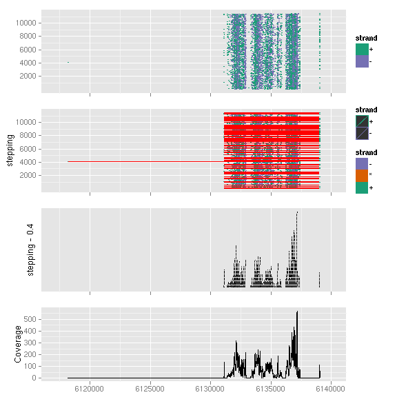

### Introduction

`autoplot` for *GappedAlignments*

_For aesthetics mapping now, users have to pass them to aes() functions and
pass it into autoplot_, for example
    
	autoplot(data, color = score)
	
won't work, you have to use 

    autoplot(data, aes(color = score))
	
for now.	

### Objects
  * *GappedAlignments*
  
### Usage
  upcomming

### Examples
Load packages


library(ggbio)
library(Rsamtools)


Read a example bam file


data("genesymbol", package = "biovizBase")
bamfile <- system.file("extdata", "SRR027894subRBM17.bam", package = "biovizBase")
## need to set use.names = TRUE
ga <- readBamGappedAlignments(bamfile, param = ScanBamParam(which = genesymbol["RBM17"]), 
    use.names = TRUE)


Example geoms


p1 <- autoplot(ga)
p2 <- autoplot(ga, show.junction = TRUE)
p3 <- autoplot(ga, geom = "rect")
p4 <- autoplot(ga, geom = "line", stat = "coverage")
tracks(p1, p2, p3, p4)


 

