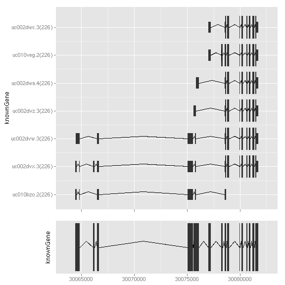
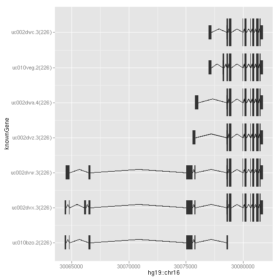

### Introduction

*TranscriptDb* is used for storing genomic features such as exons, cds,
 transcrits,`autoplot` is designed to plot gene structure, it parse information
 stored in the object to generate proper introns and utrs, it provides two
 `geom` now, one called `gene`, used to plot isoform for different
 transcript. and geom `reduce` used to reduce the information to generate single
 gene structure.

_For aesthetics mapping now, users have to pass them to aes() functions and
pass it into autoplot_, for example
    
	autoplot(data, color = score)
	
won't work, you have to use 

    autoplot(data, aes(color = score))
	
for now.	

### Objects
  * *TranscriptDb*
  
### Usage
  upcomming

### Examples
Load packages


library(ggbio)
library(TxDb.Hsapiens.UCSC.hg19.knownGene)



## Loading required package: GenomicFeatures



## Loading required package: AnnotationDbi



## Loading required package: Biobase



## Welcome to Bioconductor
## 
##     Vignettes contain introductory material; view with
##     'browseVignettes()'. To cite Bioconductor, see
##     'citation("Biobase")', and for packages 'citation("pkgname")'.
## 



data(genesymbol, package = "biovizBase")
txdb <- TxDb.Hsapiens.UCSC.hg19.knownGene


  
Two geoms


p1 <- ggplot() + stat_gene(txdb, which = genesymbol["ALDOA"])
p2 <- ggplot() + stat_gene(txdb, which = genesymbol["ALDOA"], geom = "reduced_gene")
tracks(p1, p2, heights = c(3, 1))


 

`which` argument also accept gene id.


library(org.Hs.eg.db)
aldoa_eg <- org.Hs.egSYMBOL2EG$ALDOA
p3 <- autoplot(txdb, which = list(gene_id = aldoa_eg))
p3


 

