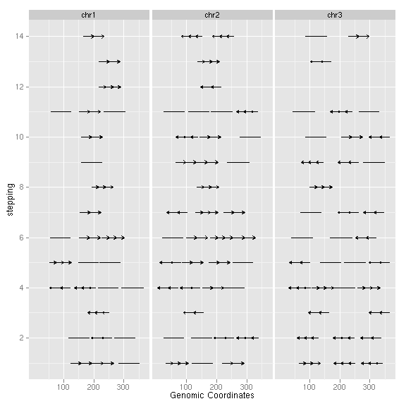
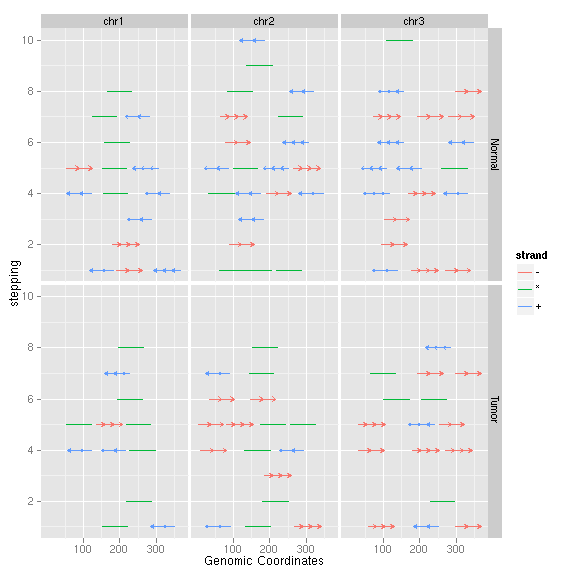
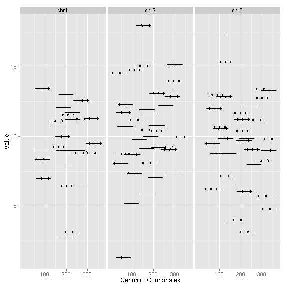
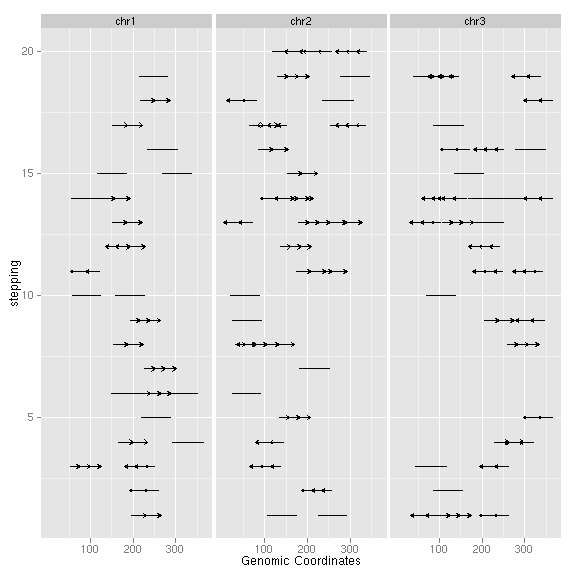
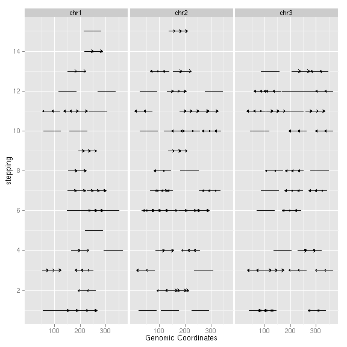
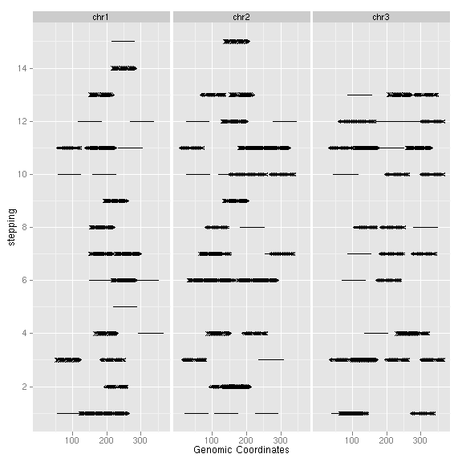

### Introduction
`geom_arrow` is lower level API for creating arrows for interval data,
such as *GRanges* object.

### Objects
  * *GRanges*
  
### Usage
  upcomming
  
### Examples
Load packages


set.seed(1)
N <- 100
require(ggbio)
require(GenomicRanges)


Let's generate some simulated interval data and store it as *GRanges* object.


## ======================================================================
## simmulated GRanges
## ======================================================================
gr <- GRanges(seqnames = sample(c("chr1", "chr2", "chr3"), size = N, 
    replace = TRUE), IRanges(start = sample(1:300, size = N, replace = TRUE), 
    width = sample(70:75, size = N, replace = TRUE)), strand = sample(c("+", 
    "-", "*"), size = N, replace = TRUE), value = rnorm(N, 10, 3), score = rnorm(N, 
    100, 30), sample = sample(c("Normal", "Tumor"), size = N, replace = TRUE), 
    pair = sample(letters, size = N, replace = TRUE))


Default is use stat stepping, which laying out the intervals randomly and assign
those intervals different stepping levels as y axis to avoid overlapped
plotting, it's a very rough exploration as first step for some interval data.


## ======================================================================
## default
## ======================================================================
ggplot() + geom_arrow(gr)


 

Facetting and aesthetics mapping are supported, make sure you put your
aesthetics mapping in constructor `aes()`, and those variables are not quoted.


## ======================================================================
## facetting and aesthetics
## ======================================================================
ggplot() + geom_arrow(gr, facets = sample ~ seqnames, aes(color = strand, 
    fill = strand))


 

Stat "identity" allows you to specify a y value to use as y-axis instead of
default stepping level.


## ======================================================================
## stat:identity
## ======================================================================
ggplot() + geom_arrow(gr, stat = "identity", aes(y = value))


 

`group` make sure grouped intervals are on the same levels when `stat =
"stepping"`,  notice that it's could be possible that those
intervals assigned in the same group are overlapped with each other.


## ======================================================================
## stat:stepping
## ======================================================================
ggplot() + geom_arrow(gr, stat = "stepping", aes(group = pair))


 

`group.selfish` force the grouped intervals to take unique stepping level,
  this is useful when you want to show the labels for each group as y axis, when
  it's disabled, the y-label will be automatically hided to avoid overlapped
  group labels as y axis.

 

There are some other options to control the appearance of arrows.
 

