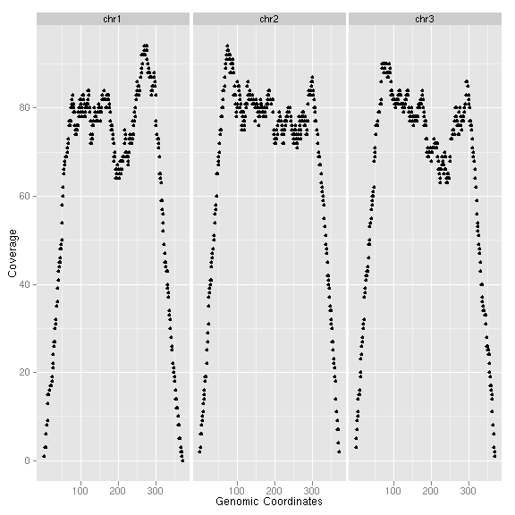
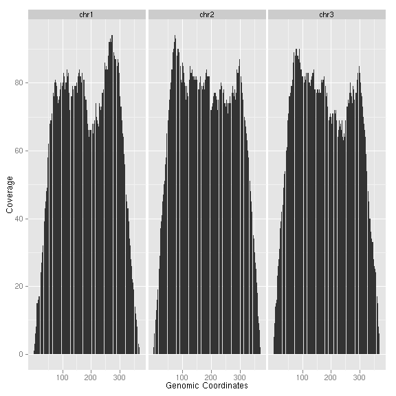
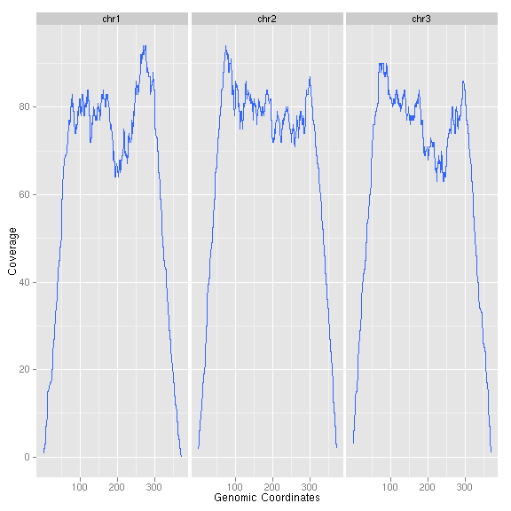
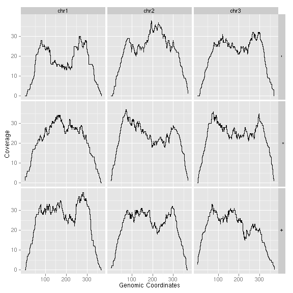
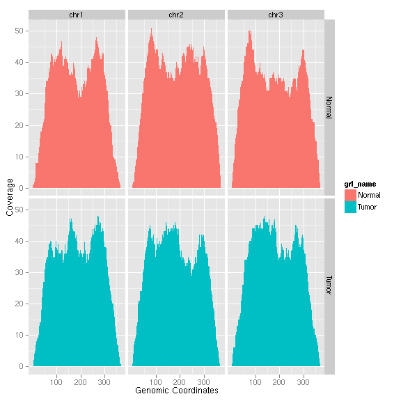

### Introduction

`stat_coverage` is lower level API computing coverage from raw bam file,
*GRanges*, and *GRangesList*. For *Bamfile*, a fast estimated method has been
implemented by Michael Lawrence in package *biovizBase* and wrapped as one
method in `stat_coverage`.

### Objects
  * *GRanges*
  * *GRangesList* 
  * *BamFile*
  
### Usage
  upcomming

### Examples
Load packages


library(ggbio)



## Loading required package: methods



## Loading required package: ggplot2



## 
## Attaching package: 'ggbio'
## 



## The following object(s) are masked from 'package:ggplot2':
## 
##     geom_rect, geom_segment, stat_identity, xlim
## 


  
Let's generate some simulated interval data and store it as *GRanges* object.


## ======================================================================
## simmulated GRanges
## ======================================================================
set.seed(1)
N <- 1000
library(GenomicRanges)



## Loading required package: BiocGenerics



## 
## Attaching package: 'BiocGenerics'
## 



## The following object(s) are masked from 'package:stats':
## 
##     xtabs
## 



## The following object(s) are masked from 'package:base':
## 
##     anyDuplicated, cbind, colnames, duplicated, eval, Filter,
##     Find, get, intersect, lapply, Map, mapply, mget, order, paste,
##     pmax, pmax.int, pmin, pmin.int, Position, rbind, Reduce,
##     rep.int, rownames, sapply, setdiff, table, tapply, union,
##     unique
## 



## Loading required package: IRanges



gr <- GRanges(seqnames = sample(c("chr1", "chr2", "chr3"), size = N, 
    replace = TRUE), IRanges(start = sample(1:300, size = N, replace = TRUE), 
    width = sample(70:75, size = N, replace = TRUE)), strand = sample(c("+", 
    "-", "*"), size = N, replace = TRUE), value = rnorm(N, 10, 3), score = rnorm(N, 
    100, 30), sample = sample(c("Normal", "Tumor"), size = N, replace = TRUE), 
    pair = sample(letters, size = N, replace = TRUE))


Test different geom, notice `..coverage..` is a variable name that is not in
original data but in transformed data, if you hope to use this new statistics,
please you `..` to wrap around `coverage`, it indicates it belongs to interval
variable. 


ggplot() + stat_coverage(gr)


 


ggplot() + stat_coverage(gr, geom = "point")


 


ggplot() + stat_coverage(gr, aes(y = ..coverage..), geom = "histogram")


 


ggplot() + stat_coverage(gr, aes(y = ..coverage..), geom = "area")


 


ggplot() + stat_coverage(gr, geom = "smooth")


 

Facetting, column for `seqnames` is requried.


ggplot() + stat_coverage(gr, geom = "line", facets = sample ~ seqnames)


 

Faceted by strand help you understand coverage from different sequencing direction. 


ggplot() + stat_coverage(gr, geom = "line", facets = strand ~ seqnames)


 

Let's create a *GRangesList* object.


grl <- split(gr, values(gr)$sample)
grl <- endoapply(grl, function(gr) {
    nms <- setdiff(colnames(values(gr)), "sample")
    values(gr) <- values(gr)[nms]
    gr
})


For *GRangesList* object, default is coerce it to *GRanges*.


ggplot() + stat_coverage(grl)


 

Internal variable `..grl_name..` added to keep a track for grouping information,
you could use it for faceting or other mapping.


ggplot() + stat_coverage(grl, geom = "area", facets = ..grl_name.. ~ 
    seqnames, aes(fill = ..grl_name..))


 

Load a RNA-seq data


library(Rsamtools)
bamfile <- "~/Datas/seqs/ENCODE/caltech/single/wgEncodeCaltechRnaSeqK562R1x75dAlignsRep1V2.bam"
bf <- BamFile(bamfile)


Default method is "estimate", which is very fast and efficient estimation for
whole genome, if you didn't provide which, we only show the first chromosome.

If you really want to get accurate coverage information on the fly, use method
"raw", make sure you provide a relatively small region for `which` argument,
otherwise, it's going to be very slow. Internally it parse short reads to
*GRanges* and then calling coverage on it.

