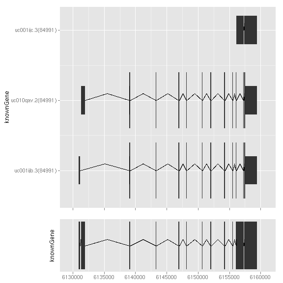
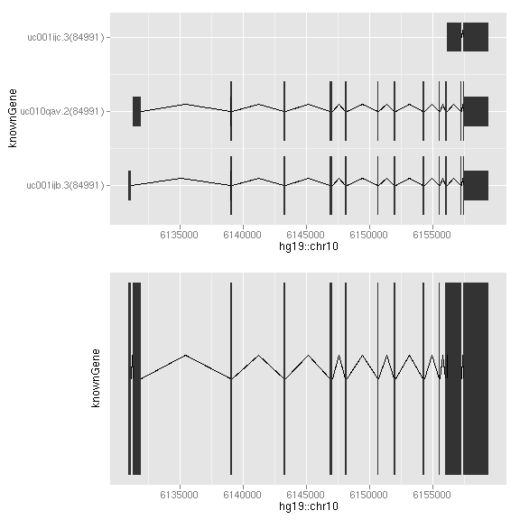
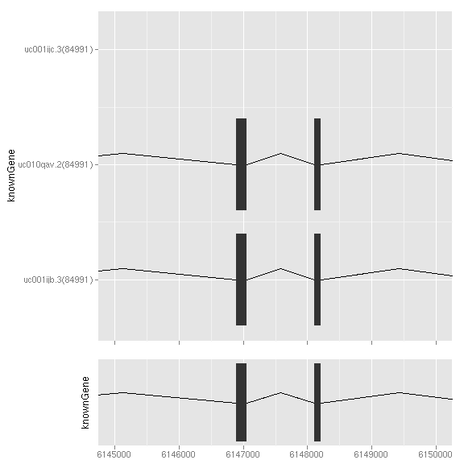
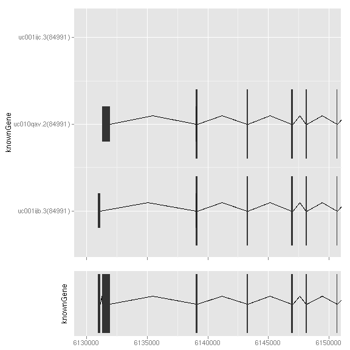
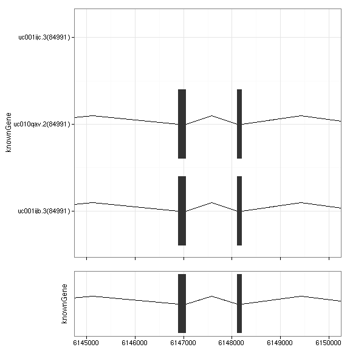

### Introduction
`tracks` is a conventient wrapper for bindind graphics as trakcs. You dont' have
to worry about adjusting different graphics, `tracks` did that for you. It's NOT
just limited to bind genomic tracks, you can use this function to bind any
tracks with the same defination of x axis, for example, sets of time series
plots you made.

Tracks view is most common way to viewing genome features and annotation data
and widely used by most genome browsers. Our assumption is that, most graphics
you made with *ggbio* or by yourself using *ggplot2*, are almost always sitting
on the genomic coordinates or the same x axis. And to compare annotation
information along with genome features, we need to align those plots on exactly
the same x axis in order to form your hypothesis. This function leaves you the
flexibility to construct each tracks separately with worrying your alignments
later.

*ggbio* provide a set of utilities to reset, backup, and apply options to
 tracks, please see examples below.

**NOTICE**: `tracks` did following things for you
 
 *  Only keep the bottom x axis based on assumption that all tracks are on the
 same space, but still keep x ticks. For simply wrapping, please use `align.plots`.
 *  `ncol` which defines columns is always 1, because binding tracks in the
    context of genomic data is almost always one single column. Multiple column
    alignments are not supported yet.

 
Alternatively you have a `align.plots` whic simply align the plots based on x axis
without modifying any other attributes about the plots.

### Objects
  * A set of ggplot graphic objects.
  
### Usage
  upcomming
  
### Examples
Load packages required for getting gene features.


## ========================================================== Load
## packages ==========================================================
## Load gene features for human
library(ggbio)
library(TxDb.Hsapiens.UCSC.hg19.knownGene)
data(genesymbol, package = "biovizBase")
txdb <- TxDb.Hsapiens.UCSC.hg19.knownGene


Let's generate two plots for full and reduced gene model, and bind them in
tracks.


## ========================================================== Create
## tracks ==========================================================
## create two tracks full gene model
p1 <- ggplot() + stat_gene(txdb, which = genesymbol["RBM17"], geom = "gene")
## reduced gene model
p2 <- ggplot() + stat_gene(txdb, which = genesymbol["RBM17"], geom = "reduced_gene")
## building tracks
obj <- tracks(p1, p2, heights = c(3, 1))
## showing
obj


 

`align.plots` simply align the plots based on x axis
without modifying any other attributes about the plots.


## ========================================================== align.plots
## ==========================================================
align.plots(p1, p2)


 

`reset` and `backup` help you play with options and appearance of the tracks,
you could save certain status by calling `backup`, and get backup version back
by calling `reset`.


## ========================================================== test
## reset/backup ==========================================================
## create tracks
obj <- tracks(p1, p2, heights = c(3, 1))
## show it
obj
## three ways to change x limits, IRanges/GRanges/numeric
xlim(obj) <- IRanges(start = 6145000, end = 6150000)
xlim(obj) <- GRanges("chr1", c(start = 6145000, end = 6150000))
xlim(obj) <- c(6145000, 6150000)
## show it
obj
## reset to original setting
obj <- reset(obj)
## get back
obj
## we could save a statue of the tracks to backup and then reset will get
## that copy back
xlim(obj) <- c(6145000, 6150000)
obj <- backup(obj)
obj@xlim <- c(6135000, 6150000)
obj
obj <- reset(obj)
obj


 

`summary` give you meta information about tracks, and `update` allow you to
update a plot xlim on the fly, you can simply keep the plot window and run
`update` to tweak with the view. Other wise you need to revise the tracks object
and print it again.


## ========================================================== utils
## ========================================================== summary
## information about a track
summary(obj)



## -------------------------------------------
## Tracks contains:  2  graphic objects
## -------------------------------------------
## xlim: 6145000 6150000 
## heights 3 1 
## track.skip -1 
## xlim.chage TRUE TRUE 
## track.plot.col white white 
## -------------------------------------------



## update a x limits on the fly, this is useful when you try to keep the
## view open and tweak with limits on the fly.
update(obj, xlim = c(6130000, 6150000))


 


## NULL


For convenient use and advanced *ggplot2* and *ggbio* users, if you are familiar
with `theme` and `options`, you could always use the same way with tracks, I
redefined `+` and make those works for `Tracks` object too. All the options will
be applied to every plot in the tracks.


## ========================================================== options
## ========================================================== To make it
## easy, you could just apply any *options* by using '+' and this will
## apply it to every plot in the track.
obj + theme_bw()


 

